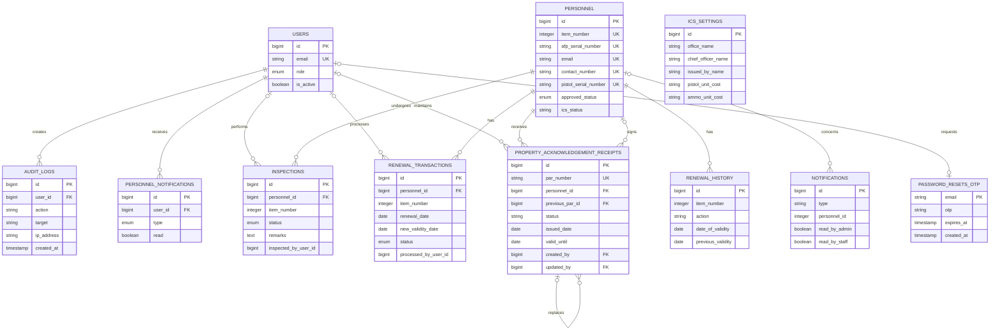
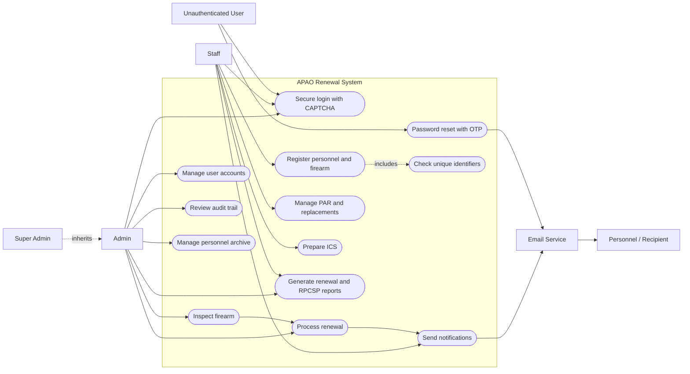

# APAO Renewal System Diagrams

These diagrams describe the current Laravel application based on its migrations, models, controllers, middleware, and routes.

The editable two-page Draw.io version is available at [`APAO_System_Diagrams.drawio`](./APAO_System_Diagrams.drawio). Open it in [diagrams.net](https://app.diagrams.net/) or the Draw.io desktop application.

The editable end-to-end operational flowchart is available at [`APAO_System_Flowchart.drawio`](./APAO_System_Flowchart.drawio). It covers authentication, staff registration and ICS submission, admin inspection and renewal, the repair/re-inspection loop, PAR issuance, persistence, notifications, audit logging, and reporting.

## Entity-Relationship Diagram

The detailed ERD source, including important attributes, is in [`erd.mmd`](./erd.mmd).

### Relationship notes

- Database foreign keys connect personnel to inspections, renewal transactions, and PAR records.
- `renewal_history.item_number` and `notifications.personnel_id` are legacy logical references to `personnel.item_number`; they are not declared foreign keys.
- `inspections.inspected_by_user_id` and `renewal_transactions.processed_by_user_id` are logical user references without database-level foreign-key constraints.
- A PAR may reference a previous PAR, allowing replacement history to form a chain.
- `issued_by_personnel_id` and `approved_by_personnel_id` allow personnel records to act as PAR signatories.
- `ics_settings` is application-wide configuration and intentionally has no parent relationship.
- Laravel cache, session, and queue infrastructure tables are omitted because they are outside the APAO business domain.

## Use Case Diagram

The expanded actor-to-use-case source is in [`use-case.mmd`](./use-case.mmd).

## Actor summary

- **Super Admin:** Inherits Admin capabilities and has top-level administrative access.
- **Admin:** Manages accounts and personnel, conducts inspections, changes renewal status, manages archives, reviews audit logs, and generates reports.
- **Staff:** Registers personnel, validates identifiers, submits records for inspection, manages ICS/PAR documents, sends notifications, and produces reports.
- **Unauthenticated User:** Logs in through CAPTCHA protection or recovers an account through email OTP.
- **Personnel / Recipient:** Receives renewal, expiry, and status email notifications.
- **Email Service / Scheduler:** Supporting actors for OTP delivery and scheduled renewal notifications.
